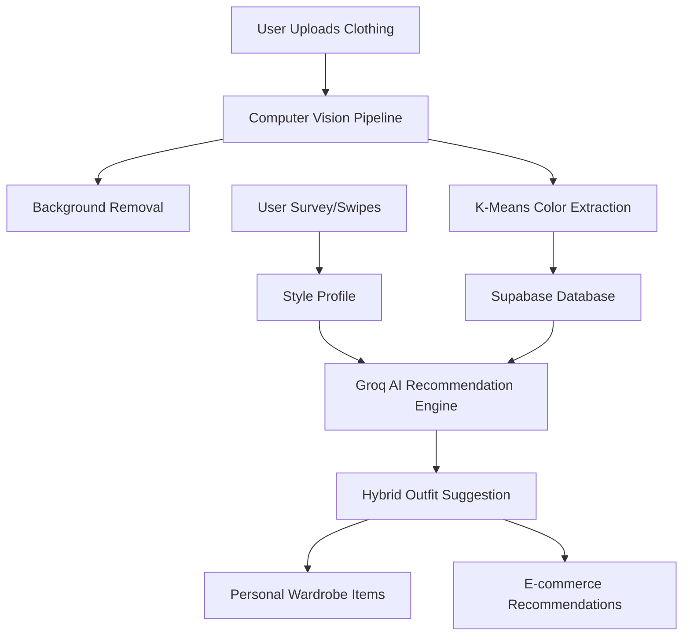

# 👗 Vibe Stylist: Your Personal AI Fashion Architect

[](https://www.python.org/)
[](https://flask.palletsprojects.com/)
[](https://supabase.com/)
[](https://groq.com/)

**Vibe Stylist** is a revolutionary AI-driven personal styling platform that bridges the gap between your physical wardrobe and professional fashion curation. By leveraging Large Language Models (LLMs) and Computer Vision, it doesn't just suggest clothes—it understands your *vibe*.

---

## ✨ Key Features

### 🛒 1. Virtual Wardrobe Management
Stop guessing what's in your closet. Upload photos of your clothing, and our system automatically:
*   **Removes Backgrounds**: Clean, professional catalog-style images.
*   **Color Extraction**: Uses K-Means clustering to identify dominant colors.
*   **Auto-Tagging**: AI classifies your items by type (e.g., Kurti, Jeans, Blazer).

### 🤖 2. Hybrid AI Recommendation Engine
Powered by **Groq (Llama 3.3)**, the engine generates complete outfit logic by:
*   **Wardrobe-First Approach**: Always prioritizes what you already own.
*   **Gap Filling**: Suggests e-commerce items (Amazon/Myntra/Flipkart) when your wardrobe has a missing piece.
*   **Context Awareness**: Tailors outfits based on your skin tone, style archetype, and the "vibe" of the day.

### 📊 3. Style Archetype & Skin Tone Analysis
Personalization at its core. Through an interactive survey and AI analysis, Vibe Stylist determines:
*   **Your Archetype**: (e.g., Clean Girl, Old Money, Streetwear, Coquette, Dark Academia, Baddie, Fusion, Minimalist).
*   **Color Palette**: Recommends colors that complement your specific skin tone.

### 🎮 4. The Daily Swipe (Gamified Personalization)
A Tinder-style interface for fashion. 
*   **Swipe Right/Left**: Train your AI personal stylist on what you love.
*   **Streaks & Badges**: Earn rewards for staying consistent with your style journey.

---

## 🛠️ Technology Stack

| Layer | Technology |
| :--- | :--- |
| **Backend** | Python / Flask |
| **Database & Auth** | Supabase (PostgreSQL) |
| **AI (LLM)** | Groq Cloud (Llama 3.3 70B) |
| **Computer Vision** | OpenCV, Scikit-learn (K-Means), PIL |
| **Frontend** | HTML5, CSS3, JavaScript, Jinja2 |
| **Integrations** | Ecommerce API placeholders (Amazon, Myntra, Flipkart) |

---

## 🏗️ Architecture Overview



---

## 🚀 Getting Started

### Prerequisites
*   Python 3.10+
*   Supabase Account
*   Groq API Key

### Installation

1.  **Clone the Repository**
    ```bash
    git clone https://github.com/SanjanaS1709/vibe-stylist.git
    cd vibe-stylist
    ```

2.  **Set Up Virtual Environment**
    ```bash
    python -m venv .venv
    source .venv/bin/activate  # On Windows use: .venv\Scripts\activate
    ```

3.  **Install Dependencies**
    ```bash
    pip install -r requirements.txt
    ```

4.  **Configure Environment Variables**
    Create a `.env` file in the root directory:
    ```env
    SUPABASE_URL=your_supabase_url
    SUPABASE_KEY=your_supabase_anon_key
    GROQ_API_KEY=your_groq_api_key
    SECRET_KEY=your_flask_secret_key
    ```

5.  **Initialize Database**
    Run the SQL scripts located in the root folder (`supabase_schema.sql`, `CREATE_SAVED_LOOK_TABLE.sql`) in your Supabase SQL Editor.

6.  **Run the Application**
    ```bash
    python app.py
    ```

---

## 📈 Future Roadmap
- [ ] **AR Try-On**: See how clothes look on you using Augmented Reality.
- [ ] **Social Stylist**: Share your "Vibe of the Day" with a community and get real-time feedback.
- [ ] **Collaborative Wardrobe**: Share items with friends for shared styling events.
- [ ] **Real-time Weather Sync**: Suggest outfits based on current local weather.

---

## 📄 License
This project is licensed under the MIT License - see the [LICENSE](LICENSE) file for details.

---
*Created with ❤️ by the Vibe Stylist Team.*
